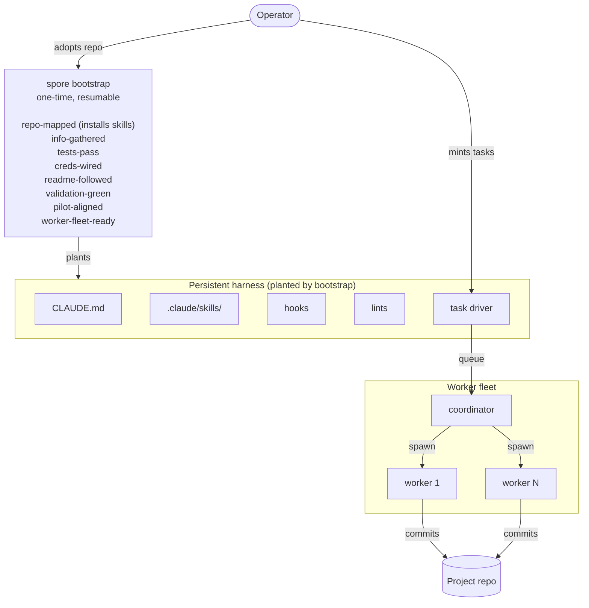

<p align="center">
  
</p>

# spore

Drop-in harness template for LLM-coding agents.

## Status

alpha. Kernel and bootstrap stage gates shipped; not yet battle-tested
against a real adoption. See `docs/design.md` for origin and rationale.

## Getting started

You start with:

- a freshly provisioned Hetzner (or any kexec-capable x86_64) VM,
  with your SSH public key in `root`'s `authorized_keys`
- the URL of the repo you want spore to drive

End state: a worker fleet on the box pulling tasks from a queue you
control.

The whole flow is four operator commands.

### 1. Install the spore CLI

```
nix profile install github:versality/spore
```

(or `go build -o ~/.local/bin/spore ./cmd/spore` from a checkout, on
Go 1.25+).

### 2. Provision the box and plant spore

`--repo` takes a local path: spore rsyncs your existing checkout to
the box (so private repos work without crossing credentials, and
your already-authenticated git config stays on your machine). One
command wipes the existing OS, installs NixOS with spore and its
runtime deps baked in, and lands the project at `/root/project`:

```
spore infect <ip> --ssh-key ~/.ssh/id_ed25519 --repo ~/projects/myrepo
```

The `.pub` sibling of `--ssh-key` becomes the post-install root
authorized key. spore excludes the obvious noise during the
transfer: `.env*` (except `.env.example`), `node_modules`,
`vendor/bundle`, `tmp`, `log`, build artifacts. See `docs/infect.md`
for prerequisites and failure hints.

### 3. Walk the bootstrap stage gates

SSH into the box and run bootstrap. It is re-entrant: each call
advances as far as the gate detectors allow, then prints the current
stage and any blocker. Two stages (`info-gathered`, `readme-followed`)
prompt the operator for short answers; everything else is automatic.

```
ssh root@<ip>
cd /root/project && spore bootstrap
```

### 4. Mint the first task and turn the fleet on

```
spore task new "first task"
spore fleet enable
spore fleet reconcile
```

A coordinator session and one worker session per active task come
up under tmux as `spore/<project>/<slug>`. Attach with `tmux attach
-t spore/<project>/coordinator` to watch them work.

> **v0 alpha**: the single-command shape above is the intended
> operator path. Pieces of step 2 and step 3 are still operator-side
> manual work in v0 (`--repo` flag, bundled-flake plants, on-box
> agent flow). The current workaround and the spec for closing the
> gap live in `docs/todo/kickstart-onecommand.md`.

## Architecture



`spore bootstrap` adopts an existing project, walking the stage gates
from `repo-mapped` through `worker-fleet-ready` to fit the kernel onto
a tree that already has its own shape. The first stage (`repo-mapped`)
plants a starter `CLAUDE.md` and drops the bundled skills under
`.claude/skills/`; later stages wire the lints, hooks, and task
driver. Once `worker-fleet-ready` reports green the kernel is in
place. `spore fleet reconcile` then walks the queue once: every
status=active task without a live worker session gets a worktree
and tmux session; sessions for tasks that left active are reaped.
The kill switch at `~/.local/state/spore/fleet-enabled` (flipped
with `spore fleet enable` / `disable`) gates the reconciler;
`spore fleet status` shows the flag plus the live session list.

## The coordinator

`spore fleet reconcile` brings up a singleton coordinator session
alongside the worker fleet whenever the kill-switch flag is on, and
tears it down when the flag goes off. The coordinator runs in the
project root (no worktree, no branch) and watches the queue: it
mints, starts, pauses, blocks, and finishes tasks; routes the
operator's attention; and keeps a small state file across respawns.
It does not edit source. That is what workers are for.

```
$ tmux ls
spore/myproj/coordinator: 1 windows ...
spore/myproj/alpha:       1 windows ...
spore/myproj/beta:        1 windows ...
```

The boot prompt is the contents of `bootstrap/coordinator/role.md`
in the project tree. To override, drop your own file at that path
before bootstrap runs; the reconciler reads it on every spawn. The
session env exports `SPORE_TASK_SLUG=coordinator` and
`SPORE_COORDINATOR_ROLE=<path>` so the agent can locate the role at
runtime. Other agents talk to it the same way they talk to a worker:
`spore task tell coordinator "<msg>"`.

## CLI reference

With Nix (and flakes enabled):

```
nix develop                                                       # drop into the dev shell (Go, gopls, just, jq, tmux, fzf, ripgrep, claude-code)
nix run github:versality/spore -- --help                          # run the kernel CLI without cloning
nix run github:versality/spore -- task new "my-task"              # create a tasks/<slug>.md
nix run github:versality/spore -- install                         # refresh skills under .claude/skills/ (also runs as the first bootstrap stage)
nix build .                                                       # build ./result/bin/spore from a checkout
```

No-Nix fallback: spore is plain Go stdlib (no external deps), so a
checkout works with `go run ./cmd/spore -- --help` or
`go build -o spore ./cmd/spore` on any Go 1.25+ toolchain.

## What it is

spore is a seed that grows into a working agent harness. It ships a
small kernel (rules, lints, hooks, and a worktree-task driver) plus
a one-time bootstrap that ends with the harness planted in a project,
ready for the operator to mint tasks. Spore maps the tree, generates
a starting `CLAUDE.md`, wires the validation gate, and walks the
operator through stage gates from `repo-mapped` through
`worker-fleet-ready`. No clean install, no rewrite. The kernel takes
root, local rules accrete, and the project becomes a place an agent
can work unattended.

## Why "spore"

A spore is small, dispersal-shaped, dormant until it lands in a
suitable substrate, and grows into something larger. The harness is
shaped the same way: one repo (or one vendored install) drops in, the
kernel takes root, local rules accrete, and the project becomes a
place an agent can work unattended. The biological metaphor matches
the operational shape better than a generic "template" or "scaffold"
framing.

## What it claims

- **Beautifully minimal.** About 5,000 lines of well-tested plain Go,
  no external dependencies, Apache 2.0. The abstraction layer is the
  kernel itself: files, processes, git, tmux, ssh. Nothing
  proprietary, nothing you do not already use every day.
- **Extremely fast.** No SaaS round-trip, no remote queue, no
  backend. Tasks land instantly, agents start instantly, the kill
  switch trips instantly. It runs at the speed of the operating
  system.
- **Local, not SaaS.** Your code never leaves your box. No vendor
  backend, no per-task pricing, no abstraction layer between you and
  the agent. SaaS harnesses route your work through someone else's
  tempo; spore runs in your shell on yours.
- **Works on any stack.** Ruby, Go, JavaScript, Rust, same flow.
  The kernel is language-agnostic by design: no language pack, no
  test-runner opinion, no CI lock-in.
- **Does not change your project.** Your code stays. Your tests
  stay. Your structure stays. Spore adds scaffolding around the
  project, not inside it.
- **Nix-first.** v1 ships as a Nix flake: the spore binary, a dev
  shell carrying the full agent tool set, and the install path
  (`nix profile install` or as a flake input). Nix gives the agent
  immense reach: `nix shell -p <pkg>` for any tool, reproducible
  builds, atomic install / upgrade, no host pollution. Consumers
  who don't use Nix can replace the packaging layer themselves;
  spore does not promise that path as a first-class story.
- **Resumable.** The bootstrap flow records progress in a state
  file; re-running picks up where it left off.
- **Doc-first.** Rules, runbooks, and design notes live in committed
  markdown the agent can read on demand.

## Bootstrap a fresh server

`spore infect` wraps
[nixos-anywhere](https://github.com/nix-community/nixos-anywhere) to
turn a freshly provisioned cloud VM (root-reachable, kexec-capable
x86_64 Linux) into a minimal NixOS host. The target is wiped.

```
spore infect 203.0.113.7 --ssh-key ~/.ssh/id_ed25519
```

The default flake is the bundled single-disk EFI ext4 config at
`bootstrap/flake/`. The `.pub` sibling of `--ssh-key` becomes the
post-install root authorized key. See `docs/infect.md` for the full
flag reference, prerequisites, and failure hints.

## Consuming the NixOS module

Once a project is `worker-fleet-ready`, downstream NixOS hosts can
autostart the reconciler by importing `nixosModules.spore-fleet`
from this flake. The module declares a systemd-user oneshot driven
by a 60s timer plus Path watchers on the project's `tasks/` and
on the kill-switch flag at `~/.local/state/spore/fleet-enabled`,
so flipping `spore fleet enable` or committing a new active task
is responsive even on a slow tick. home-manager wiring for the
target user is assumed. Example:

```nix
{
  inputs = {
    spore.url = "github:versality/spore";
    home-manager.url = "github:nix-community/home-manager";
  };

  outputs = { self, nixpkgs, spore, home-manager }: {
    nixosConfigurations.worker = nixpkgs.lib.nixosSystem {
      system = "x86_64-linux";
      modules = [
        spore.nixosModules.spore-fleet
        home-manager.nixosModules.home-manager
        ({ ... }: {
          users.users.spore = {
            isNormalUser = true;
            linger = true;
          };
          home-manager.users.spore.home.stateVersion = "25.11";
          services.spore-fleet = {
            enable = true;
            user = "spore";
            projectRoot = "/home/spore/project";
            maxWorkers = 6;
          };
        })
      ];
    };
  };
}
```

`package` and `claudeCodePackage` default to this flake's outputs;
override either to pin a specific build. Workers spawn `claude`
(claude-code), which manages its own credential lifecycle inside
the client; the module deliberately exposes no Anthropic API-key
slot. The `credentialFiles` option is for non-claude secrets the
workers might still need (MCP server keys, git-push PATs, etc.) and
wires them through systemd `LoadCredential=` so values never enter
Nix evaluation or `/nix/store`. Full option reference lives in
`nixosModules/spore-fleet.nix`.

### Horizontal scale

Capacity scales additively by enabling the module on N hosts that
all see the same project tree (shared filesystem or per-host
checkouts of one branch). Each reconciler picks up active tasks it
notices first; `services.spore-fleet.hostId` (default
`networking.hostName`) surfaces in `SPORE_HOST_ID` so logs and
operator-facing chips can disambiguate a fleet across hosts. The
kill-switch flag is per-host, per-user: paused on one machine
does not pause another. There is no cross-host lock layer: races
on `tasks/<slug>.md` frontmatter are tolerated by spore's file-
based comms shape, not arbitrated. Treat this as best-effort
coordination; a v0.next iteration may add a distributed lock once
usage shows it is needed.

## Harness extras

Optional drop-ins that downstream consumers can wire on top of the
kernel. Templates only - bring your own credentials.

- **MCP server templates** at `bootstrap/mcp/`. Reddit, Kagi, Hacker
  News, and GitHub MCP servers, configured with `${ENV_VAR}`
  placeholders for every secret slot. `bootstrap/mcp/README.md` lists
  required envvars per server, anonymous-vs-authenticated posture,
  and the install path.
- **Diagram skill** at `bootstrap/skills/diagram/`. Tmux side-pane
  structural visualizer: `diagram "<title>" <file>` appends a
  timestamped entry (note + optional rendered DSL) to a per-session
  pane and persists it on disk. Portable bash, optional `graph-easy`
  for layout. `bootstrap/skills/diagram/README.md` covers install and
  tmux integration.
- **claude-code**: tracked from upstream `sadjow/claude-code-nix`;
  always current via `nix flake update` on the spore tree. Available
  in the dev shell as `claude` and as `nix run github:versality/spore#claude-code`.

## What it does NOT claim (v0)

- No secrets layer and no activation system. Those are operator-bound
  and vary per project; spore stops at "the gate is wired and green".

## Drop-in flow

1. Operator runs `spore bootstrap` in an existing project repo. The
   first stage (`repo-mapped`) drops a starter `CLAUDE.md` if absent
   and installs the bundled skills into `.claude/skills/` so
   claude-code can discover them.
2. The agent maps the project, detects language and test runner, and
   walks through stage gates: `repo-mapped`, `info-gathered`,
   `tests-pass`, `creds-wired`, `readme-followed`,
   `validation-green`, `pilot-aligned`, `worker-fleet-ready`.
3. State persists in a project-local state file. Re-runs resume.
   `spore install` refreshes skills without re-running bootstrap.

## License

spore is licensed under the Apache License, Version 2.0.
See `LICENSE` for the full text.
